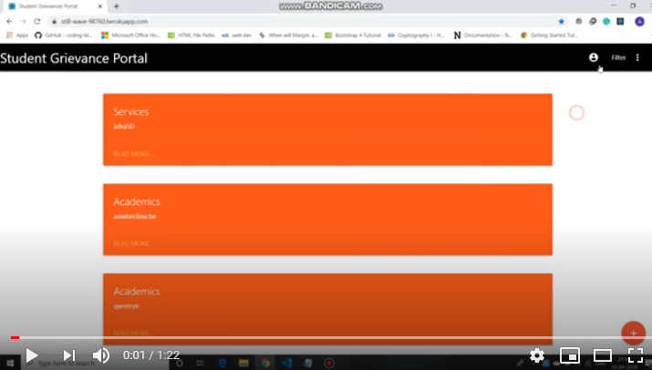

# Student-Grievance-Portal
Hello Everyone, Contributors to this project are [Aniket Biswas](https://github.com/aniketbiswas21), [Aryaman Grover](https://github.com/Aryaman1706), and [Saurav Shrivastav](https://github.com/Saurav-Shrivastav). 
We are making this project to ensure that every issue of the students in an institution is heard by the concerned authorities.
There are certain issues that we need to talk about and get them resolved but are either hesitant to take the issues to higher authorities or the authorities themselves ignore the issue due to lack of response of the students. 
Here is where our portal comes to the rescue. We have designed this portal where students can report an issue/grievance on the portal and other fellow students can upvote or downvote the issue/grievance as per their understanding/relevance. 
To monitor all these requests we would give special privileges to what we call "The Student Council". 
Once an issue/grievance is cross-checked by the students and the student council, the request would be forwarded to the concerned authorities and regular updates would be shared on the platform.

## Motivation
We initiated this project after attending a Bootcamp by Developer Student Club of Thapar University, Patiala.

## Stack used
* M - MongoDB
* E - Express
* R - React.js
* N - Node.js

We've also used Materialize CSS

## Demo 

[](https://youtu.be/6Go91-rAxiY)

## Installation 

### Windows

1. Clone the project on your local machine by typing the following command in CMD.
```bash
git clone https://github.com/Saurav-Shrivastav/Student-Grievance-Portal.git
```

2. Navigate to the project folder and run the following command to download the node_modules for the server.
```bash
npm i
```

3. Start the server by running the following command
```bash
node index.js
```

4. Open a new CMD window and navigate to the Student-Grievance-Portal -> client and run the following commands:
```bash
npm install create-react-app
```

```bash
npm install axios --save
```

```bash
npm install react-router-dom --save
```

```bash
npm install reactjs-popup
```

5. Finally run the following command and a new tab will automatically open in your default browser.
```bash
npm start
```

### OS X
Coming soon!

### Linux 
Coming soon!

## Contributing
Pull requests are welcome. For major changes, please open an issue first to discuss what you would like to change.

Please make sure to update tests as appropriate.

